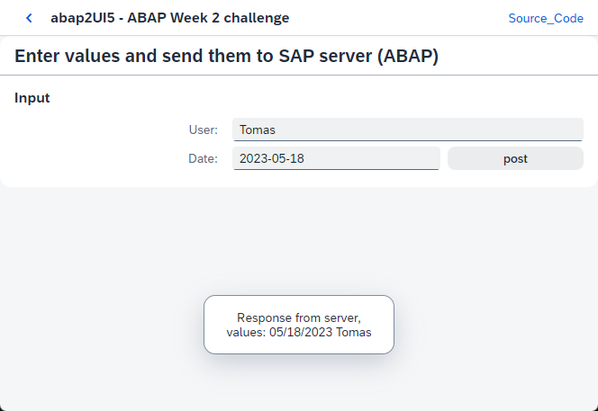

# 2023 SAP Developer Code Challenge – Open-Source ABAP

Details about challenge:

https://blogs.sap.com/2023/05/10/sap-developer-code-challenge-open-source-abap/

## Week 1
Simple Hello World class pushed to GitHub: [ZCL_HELLO_WORLD.CLAS.ABAP](https://github.com/TBuryanek/SAP-Developer-Code-Challenge-Open-Source-ABAP-Week-1/blob/main/src/zcl_hello_world.clas.abap)

## Week 2
[ABAP2UI5](https://github.com/oblomov-dev/abap2UI5) simple demo implementation: [ZCL_TB_DEV_CHALLENGE_WEEK2_NEW.CLAS.ABAP](https://github.com/TBuryanek/SAP-Developer-Code-Challenge-Open-Source-ABAP/blob/main/src/zcl_tb_dev_challenge_week2_new.clas.abap)

## Week 3
[ABAP Mustache](https://github.com/sbcgua/abap_mustache) simple demo implementaion: [ZCL_TB_DEV_CHALLENGE_WEEK3.CLAS.ABAP](https://github.com/TBuryanek/SAP-Developer-Code-Challenge-Open-Source-ABAP/blob/main/src/zcl_tb_dev_challenge_week3.clas.abap)

## Week 4
TODO: Upcoming :)
